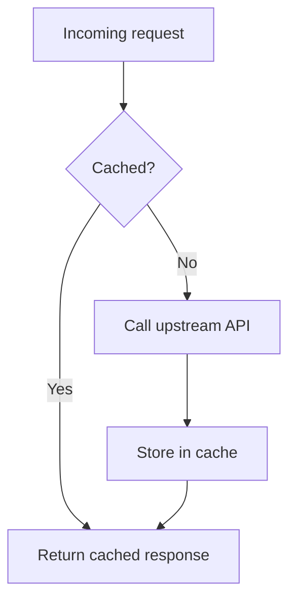

# Create-Plan-MD

Writes a persistent, hand-editable markdown implementation plan to disk before execution begins. Plain-markdown sibling of `/create-plan` (the visual HTML default). Hand-off target: `/execute-plan-md`.

**Model split:** intent gathering runs in the session. Drafting (Step 4) runs in ONE sub-agent on the strongest model (`draft_model`, default `opus`). Validation (Step 5) runs in a separate, independent `opus` sub-agent. Execution is handed to `/execute-plan-md`, which runs on `sonnet`.

## User Preferences

Load preferences at the start of every run:

1. If `${CLAUDE_PLUGIN_DATA}/preferences/create-plan-md.md` does not exist, seed it:
   ```bash
   mkdir -p "${CLAUDE_PLUGIN_DATA}/preferences"
   cp "${CLAUDE_PLUGIN_ROOT}/skills/create-plan-md/preferences.template.md" \
      "${CLAUDE_PLUGIN_DATA}/preferences/create-plan-md.md"
   ```
   Mention it once: "Seeded preferences at `${CLAUDE_PLUGIN_DATA}/preferences/create-plan-md.md` — edit anytime to customize."
2. Read it. Empty fields fall back to these defaults:
   - `plans_dir`: `docs/plans/` if it exists in the repo, else `plans/`
   - `open_after_create`: `true`
   - `default_tdd`: ask
   - `draft_model`: `opus`

## When to use

- Multi-file change where scope isn't obvious, or multi-session work that must survive `/clear`
- The user wants markdown (diffable in a repo, or a short plan where the HTML layer is overkill)

## When NOT to use

- Single-sentence diffs ("rename X to Y", "add a log line"): just do it
- Exploratory Q&A, or anything under about 5 tool calls: use TodoWrite
- Research-heavy work with unclear scope: research first (`deep-research`), plan after

## Workflow

### Step 1: Gather intent via AskUserQuestion

Ask in sequence (AskUserQuestion, not chat). Skip any question the triggering message already answered. Mark the recommended option in each label.

1. **Scope clarity** — `clear (I know what to build)` / `unclear (need to brainstorm first)`. If unclear, brainstorm with the user first (open questions until the scope is concrete; use a brainstorming skill if one is installed), then continue.
2. **Needs current external data?** — `no (working from known context)` / `yes (fresh docs, API, library or best-practice research)`. If yes, run `deep-research` first, then continue.
3. **Goal** — "What's the one-sentence goal?" (free text).
4. **Complexity** — `1 phase (<5 tasks)` / `2-3 phases (standard)` / `exhaustive (4+ phases)`.
5. **TDD?** — `yes (code with tests)` / `no (ops/docs/config)`. Skip when `default_tdd` is set.

### Step 2: Resolve the plan directory

```bash
PLAN_DIR_RESOLVED="$(bash "${CLAUDE_PLUGIN_ROOT}/skills/create-plan-md/helpers/resolve-plan-dir.sh" "${CLAUDE_PLUGIN_DATA}/preferences/create-plan-md.md")"
```

Priority: `$PLAN_DIR` env var → `plans_dir` preference → `<repo>/docs/plans/` if it exists → `<repo>/plans/` (or `$PWD/plans/` outside git). The helper creates the directory and prints its absolute path.

### Step 3: Slug and filename

- Slug: lowercase the goal, replace non-alphanumerics with `-`, strip leading/trailing `-`, keep it short.
- Filename: `YYYY-MM-DD-<slug>.md` (date from `date +%Y-%m-%d`). If it exists, append `-v2`, `-v3`, and so on.

### Step 4: Draft with one sub-agent, then fill the template

Spawn ONE Agent (`model: <draft_model>`). Its brief carries, verbatim:

1. The Step 1 answers (goal, scope, complexity, TDD, any brainstorm/research output paths).
2. The repo root it may read, and the instruction to open the real files and grep the real symbols before decomposing. Tickets and descriptions go stale; the code at HEAD does not.
3. The phase block shape and verification rules below, plus the diagram criteria.
4. A temp path to write the draft to: `/tmp/plan-draft-<slug>.md`. The sub-agent writes only that file: no plan-dir writes, no opening, no commits, no user questions.

When it returns, read the draft, then read `${CLAUDE_PLUGIN_ROOT}/skills/create-plan-md/templates/plan-template.md` and substitute:

- `{{FEATURE_NAME}}` — the one-sentence goal; `{{DATE}}` — today; `{{SLUG}}` — the slug
- `{{PHASES}}` — the drafted phase blocks (count matches the complexity answer)
- `{{DIAGRAMS}}` — the drafted `## Diagrams` section, or nothing at all if no diagram helps

Per-task step shapes live in `templates/task-tdd.md` (TDD) and `templates/task-no-tdd.md` (Implement → Verify → Commit). Also fill the Architecture section. Write with the Write tool. Do NOT commit.

**Detail bar:** distinct phases, each a coherent milestone; tasks small enough that an executor on `sonnet` can do each without re-deriving context. Prefer more, smaller tasks.

#### Verification is mandatory per task and per phase

- **Per task:** the last step before the commit is `Verify:` naming observable proof: a command and its expected output or exit code, a passing test, a file or route that exists, a log line, a UI state. E.g. ``Verify: `pytest tests/test_foo.py -q` → all green``. Never `Verify: confirm it works`.
- **Per phase:** every phase ends with a `### Verification` checklist of exit criteria that must all pass before the next phase starts.

Phase block shape:

```
## Phase 1: <name>

### Task 1.1: <task name>
**Files:** Create: ..., Modify: ...
- [ ] <step>
- [ ] <step>
- [ ] Verify: <concrete command/check + expected result>
- [ ] Commit: <type(scope): message>

### Verification
- [ ] <phase exit criterion 1, a concrete check>
- [ ] <phase exit criterion 2>
```

#### Diagrams (only when they help)

Add a `## Diagrams` section at the end, with one or more fenced ` ```mermaid ` blocks, only if: the work touches 3+ components with non-trivial relationships, there's a state machine or branching flow, a before/after architecture comparison clarifies the change, or the work is async/event-driven. Skip it for prose edits in 1-2 files, single-component bugfixes, and linear edit lists. Pick the chart type that fits (`flowchart`, `sequenceDiagram`, `stateDiagram-v2`, `erDiagram`), keep it under about 15 nodes, and put a one-sentence caption above each.

````
## Diagrams

How a request reaches the cache after the change:


````

### Step 5: Validate with an independent sub-agent (required)

A plan never checked against the code is a draft. Spawn ONE Agent on `model: "opus"`, separate from the drafter. Give it the absolute plan path and instruct it to:

1. Read the plan in full.
2. Open every `Create:`/`Modify:`/`Reference:` path and grep for every symbol, function and config the plan assumes exists.
3. Report every **missing piece**, **mistake** (wrong path, nonexistent or different API, wrong assumption, cross-phase contradiction, out-of-order dependency) and **unverifiable step**.
4. Give each issue a severity (blocker / should-fix / nit), its location in the plan, and the concrete fix.

Apply blocker and should-fix findings directly to the markdown. Re-run validation once if the fixes were substantial. Record unresolved nits in the Decisions Made table. Tell the user in one line what validation found and fixed.

### Step 6: Open

Skip if `$PLAN_NO_OPEN` is set (the `create-plan-and-execute-md` wrapper sets it) or `open_after_create` is `false`. Otherwise open with the OS default app for `.md`:

```bash
if [[ -z "${PLAN_NO_OPEN:-}" ]]; then
  if command -v open >/dev/null; then open "$PLAN_PATH"; elif command -v xdg-open >/dev/null; then xdg-open "$PLAN_PATH"; fi
fi
```

If neither opener exists, just print the path.

### Step 7: Report and hand off

- Print the absolute path.
- "Edit freely, then run `/execute-plan-md <path>` when ready."

Do NOT start executing unless the user explicitly asks. Archival to `done/` is `/execute-plan-md`'s job.

## Design notes

- No YAML frontmatter in plan files, so they stay editable in any tool.
- Date-prefixed filenames sort naturally and let several plans coexist.
- TDD is opt-in per plan: code gets red/green/refactor, ops/docs get Implement/Verify/Commit.

## Anti-patterns

- Creating the plan without asking for the goal first.
- Auto-committing the plan file (`/execute-plan-md` bundles it into the first task commit).
- Starting execution in the same turn.
- Skipping Step 5 because execution follows immediately.
