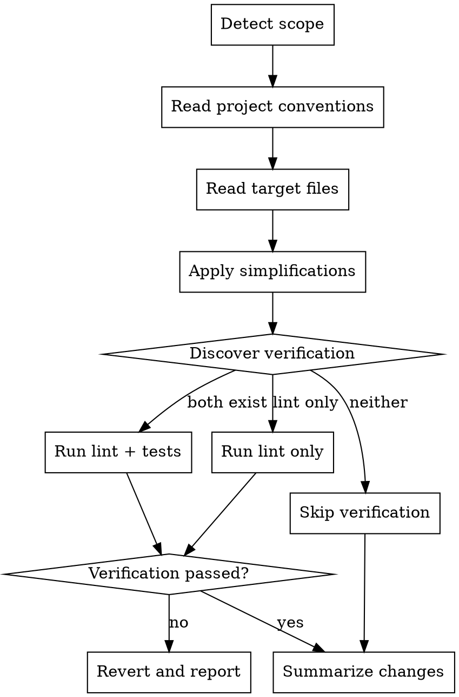

# Simplifying Code

## Overview

Post-implementation cleanup that simplifies recently written code without changing behavior. Focuses on readability, reducing duplication, and removing over-engineering.

**Core principle:** Simplify structure, never change logic.

## When to Use

- After completing a feature or bugfix, before committing
- When explicitly asked to simplify specific files or functions
- **NOT** for greenfield code design or architectural refactoring

## Process



### 1. Detect Scope

- **Default:** Find files changed in the current session via `git diff` (against base branch or last commit)
- **Override:** If the user specifies files or functions, use those instead
- If no git context and no explicit targets, ask the user what to simplify

### 2. Read Project Conventions

Scan for style configs and follow them:

| Language | Look for |
|----------|----------|
| JS/TS | `.eslintrc*`, `prettier*`, `.cursor/rules/` |
| Python | `pyproject.toml`, `.flake8`, `setup.cfg` (black/ruff/flake8) |
| Go | `golangci-lint` config |
| General | `.editorconfig`, `.cursor/rules/`, `CLAUDE.md` |

Simplified code **must** match project style.

### 3. Apply Simplifications

Make changes directly to files. Target these categories in priority order:

**Readability:**
- Clearer variable/function names
- Reduce nesting depth (early returns, guard clauses)
- Break long functions into smaller ones
- Simplify complex conditionals

**Reducing duplication:**
- Extract repeated code patterns
- DRY up similar blocks
- Consolidate related logic

**Removing over-engineering:**
- Strip unnecessary abstractions
- Remove redundant error handling
- Eliminate premature generalization
- Delete unused helpers/utilities created in this session

### 4. Run Available Verification

Discover and run what exists:

```
# JS/TS projects
Look for: npm/pnpm/yarn lint scripts, test scripts in package.json

# Python projects
Look for: flake8, ruff, black --check, pytest

# Go projects
Look for: golangci-lint, go test

# If nothing found: skip verification
```

**If verification fails:** Revert all changes (`git checkout -- <files>`) and report what failed so the user can decide.

### 5. Summarize Changes

Output a brief list of what was simplified per file:
```
Simplified 3 files:
- src/auth.ts: extracted repeated token validation into validateToken(), flattened nested if/else
- src/api.ts: renamed ambiguous variables (d → response, x → retryCount)
- src/utils.ts: removed unused buildCacheKey() helper
```

## Hard Constraints

- **NEVER** change function signatures or public APIs
- **NEVER** alter logic, control flow, or behavior
- **NEVER** add new features, comments, docstrings, or type annotations to unchanged code
- **NEVER** create new files or abstractions
- **NEVER** change test expectations or assertions

## Common Mistakes

| Mistake | Fix |
|---------|-----|
| Renaming exported functions | Only rename internal/local identifiers |
| "Simplifying" by merging unrelated functions | Each function should keep its single responsibility |
| Removing error handling that looks redundant but guards edge cases | Only remove truly unreachable error handling |
| Over-DRYing — extracting a shared helper for 2 similar lines | Three similar lines is better than a premature abstraction |
| Adding type annotations "while you're at it" | Only simplify, don't enhance |
